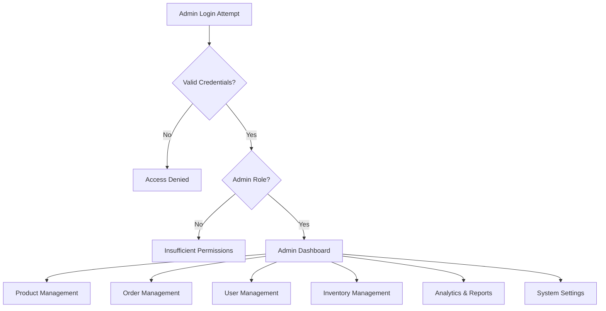
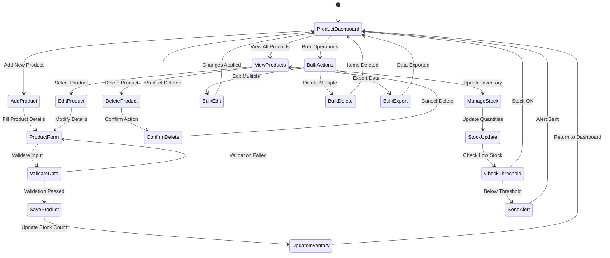
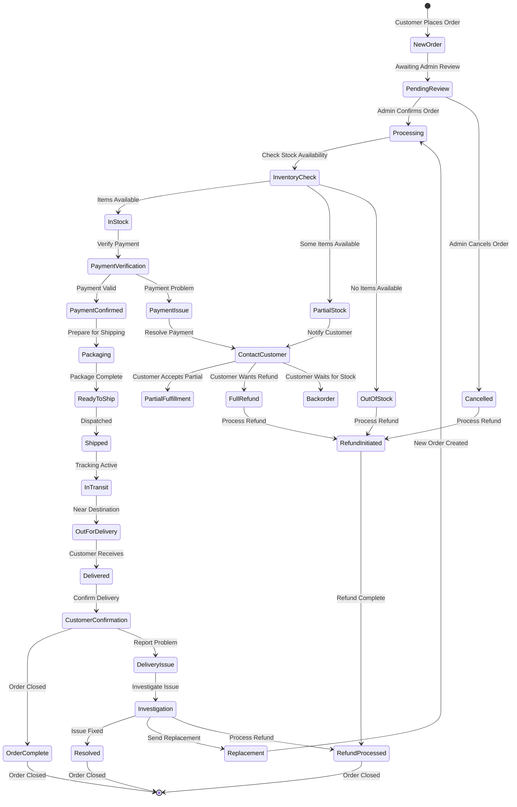
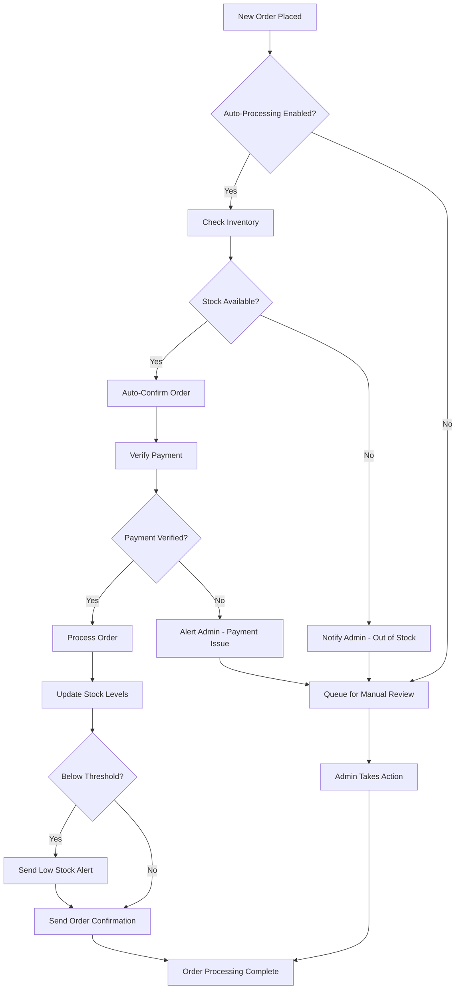

# 👨‍💼 Admin Flow Diagram - Ramro E-commerce

## 🎯 **Admin Dashboard Architecture**

This document provides a detailed visual representation of the admin workflow and management system for the Ramro e-commerce platform.

---

## 🔐 **Admin Access Flow**

```
🔑 Admin Login → 🛡️ Role Verification → 📊 Dashboard Access → 🎛️ Management Tools
```

---

## 🏗️ **Complete Admin Workflow**

### **Admin Authentication & Authorization**


### **Product Management Workflow**


---

## 📊 **Admin Dashboard Interface**

### **Main Dashboard Layout**
```
┌─────────────────────────────────────────────────────────────┐
│ 🏔️ Ramro Admin Dashboard                    👤 Admin ▼    │
│ ═══════════════════════════════════════════════════════════ │
│                                                             │
│ 📊 Quick Stats                                             │
│ ┌─────────┐ ┌─────────┐ ┌─────────┐ ┌─────────┐           │
│ │📦 Products│ │📋 Orders │ │👥 Users  │ │💰 Revenue│           │
│ │   127    │ │   45     │ │   234    │ │ ₹45,670  │           │
│ │ +12 today│ │ +8 today │ │ +5 today │ │ +₹2,340  │           │
│ └─────────┘ └─────────┘ └─────────┘ └─────────┘           │
│                                                             │
│ 🚨 Alerts & Notifications                                  │
│ ┌─────────────────────────────────────────────────────────┐ │
│ │ ⚠️ Low Stock Alert: 3 products below threshold         │ │
│ │ 📦 5 orders pending processing                          │ │
│ │ 💳 2 payment verification required                      │ │
│ └─────────────────────────────────────────────────────────┘ │
│                                                             │
│ 📈 Recent Activity                                         │
│ • New order #ORD-2024-156 - ₹1,299                        │
│ • Product "Wild Honey" stock updated                       │
│ • User "john@email.com" registered                         │
│ • Order #ORD-2024-155 shipped                             │
│                                                             │
│ Navigation: [📦 Products] [📋 Orders] [👥 Users] [📊 Analytics] │
└─────────────────────────────────────────────────────────────┘
```

### **Product Management Interface**
```
┌─────────────────────────────────────────────────────────────┐
│ 📦 Product Management                                       │
│ ═══════════════════════════════════════════════════════════ │
│                                                             │
│ [➕ Add Product] [📤 Import] [📥 Export] [🔍 Search...    ] │
│                                                             │
│ Filters: [All Categories ▼] [In Stock ▼] [Featured ▼]     │
│                                                             │
│ ┌─────────────────────────────────────────────────────────┐ │
│ │ Product List (127 items)                                │ │
│ │ ─────────────────────────────────────────────────────── │ │
│ │ 🖼️ │ Name              │ Price │ Stock │ Status │ Actions│ │
│ │ ─────────────────────────────────────────────────────── │ │
│ │ 🥒 │ Darjeeling Pickle │ ₹299  │  15   │ Active │ ✏️🗑️  │ │
│ │ 🍯 │ Wild Honey        │ ₹499  │   3   │ Low    │ ✏️🗑️  │ │
│ │ 🌾 │ Red Rice          │ ₹450  │   0   │ Out    │ ✏️🗑️  │ │
│ │ 🧂 │ Black Salt        │ ₹180  │  25   │ Active │ ✏️🗑️  │ │
│ └─────────────────────────────────────────────────────────┘ │
│                                                             │
│ Pagination: [← Previous] [1] [2] [3] [Next →]             │
└─────────────────────────────────────────────────────────────┘
```

### **Add/Edit Product Form**
```
┌─────────────────────────────────────────────────────────────┐
│ ➕ Add New Product                                          │
│ ═══════════════════════════════════════════════════════════ │
│                                                             │
│ Basic Information                                           │
│ Product Name: [Himalayan Rock Salt                       ] │
│ Category: [Spices & Seasonings ▼]                         │
│ SKU: [HRS-001                                            ] │
│                                                             │
│ Description:                                                │
│ ┌─────────────────────────────────────────────────────────┐ │
│ │ Pure rock salt from the Himalayan mountains, rich in   │ │
│ │ minerals and perfect for cooking and health benefits.  │ │
│ │                                                         │ │
│ └─────────────────────────────────────────────────────────┘ │
│                                                             │
│ Pricing & Inventory                                         │
│ Price: [₹ 250                    ] Weight: [500g         ] │
│ Stock: [50                       ] Min Stock: [5         ] │
│                                                             │
│ Product Images                                              │
│ ┌─────────┐ ┌─────────┐ ┌─────────┐                       │
│ │ 📷 Main │ │ 📷 Alt1 │ │ ➕ Add  │                       │
│ │ Image   │ │ Image   │ │ Image   │                       │
│ └─────────┘ └─────────┘ └─────────┘                       │
│                                                             │
│ Product Features                                            │
│ ☑️ Organic Certified  ☑️ Gluten Free  ☑️ Vegan            │
│ ☑️ Featured Product   ☐ Limited Edition                   │
│                                                             │
│ [Cancel] [Save Draft] [Publish Product] 🚀                │
└─────────────────────────────────────────────────────────────┘
```

---

## 📋 **Order Management Workflow**

### **Order Processing States**


### **Order Management Interface**
```
┌─────────────────────────────────────────────────────────────┐
│ 📋 Order Management                                         │
│ ═══════════════════════════════════════════════════════════ │
│                                                             │
│ Filters: [All Status ▼] [Today ▼] [All Payment ▼]         │
│ Search: [Order ID or Customer Email...              ] 🔍   │
│                                                             │
│ ┌─────────────────────────────────────────────────────────┐ │
│ │ Orders (45 total)                                       │ │
│ │ ─────────────────────────────────────────────────────── │ │
│ │ Order ID    │ Customer      │ Total │ Status    │ Actions│ │
│ │ ─────────────────────────────────────────────────────── │ │
│ │ #ORD-156    │ john@mail.com │ ₹1,299│ Processing│ 👁️✏️📦 │ │
│ │ #ORD-155    │ jane@mail.com │ ₹899  │ Shipped   │ 👁️📍  │ │
│ │ #ORD-154    │ bob@mail.com  │ ₹1,599│ Delivered │ 👁️    │ │
│ │ #ORD-153    │ alice@mail.com│ ₹699  │ Cancelled │ 👁️💰  │ │
│ └─────────────────────────────────────────────────────────┘ │
│                                                             │
│ Quick Actions:                                              │
│ [📦 Bulk Ship] [📧 Send Updates] [📊 Export Report]       │
└─────────────────────────────────────────────────────────────┘
```

### **Order Detail View**
```
┌─────────────────────────────────────────────────────────────┐
│ 📋 Order Details - #ORD-2024-156                          │
│ ═══════════════════════════════════════════════════════════ │
│                                                             │
│ Order Information                                           │
│ Date: March 15, 2024, 2:30 PM    Status: [Processing ▼]   │
│ Customer: john@email.com          Payment: ✅ Confirmed    │
│                                                             │
│ Items Ordered                                               │
│ ┌─────────────────────────────────────────────────────────┐ │
│ │ 🥒 Darjeeling Pickle × 2        ₹299 × 2 = ₹598       │ │
│ │ 🍯 Wild Honey × 1               ₹499 × 1 = ₹499       │ │
│ │ 🌾 Red Rice × 1                 ₹450 × 1 = ₹450       │ │
│ └─────────────────────────────────────────────────────────┘ │
│                                                             │
│ Order Summary                                               │
│ Subtotal: ₹1,547    Tax: ₹124    Shipping: Free           │
│ Total: ₹1,671                                              │
│                                                             │
│ Shipping Address                                            │
│ John Doe                                                    │
│ 123 Main Street, Apartment 4B                             │
│ Mumbai, Maharashtra 400001                                  │
│ Phone: +91 9876543210                                      │
│                                                             │
│ Order Actions                                               │
│ [📧 Email Customer] [📦 Mark as Shipped] [❌ Cancel Order] │
│ [💰 Process Refund] [📝 Add Notes] [🖨️ Print Invoice]     │
│                                                             │
│ Tracking Information                                        │
│ Tracking Number: [TRK123456789                          ] │
│ Carrier: [India Post ▼]                                   │
│ [📍 Update Tracking] [📧 Send Tracking Email]             │
└─────────────────────────────────────────────────────────────┘
```

---

## 👥 **User Management System**

### **User Management Interface**
```
┌─────────────────────────────────────────────────────────────┐
│ 👥 User Management                                          │
│ ═══════════════════════════════════════════════════════════ │
│                                                             │
│ Filters: [All Roles ▼] [Active ▼] [Registration Date ▼]   │
│ Search: [Email or Name...                           ] 🔍   │
│                                                             │
│ ┌─────────────────────────────────────────────────────────┐ │
│ │ Users (234 total)                                       │ │
│ │ ─────────────────────────────────────────────────────── │ │
│ │ Name          │ Email           │ Role     │ Status │ Actions│
│ │ ─────────────────────────────────────────────────────── │ │
│ │ John Doe      │ john@email.com  │ Customer │ Active │ 👁️✏️  │ │
│ │ Jane Smith    │ jane@email.com  │ Customer │ Active │ 👁️✏️  │ │
│ │ Admin User    │ admin@ramro.com │ Admin    │ Active │ 👁️✏️  │ │
│ │ Bob Wilson    │ bob@email.com   │ Customer │ Inactive│ 👁️✏️  │ │
│ └─────────────────────────────────────────────────────────┘ │
│                                                             │
│ User Statistics                                             │
│ Total Users: 234  │  Active: 198  │  New This Month: 23    │
│ Customers: 230    │  Admins: 4    │  Inactive: 36          │
└─────────────────────────────────────────────────────────────┘
```

### **User Detail & Management**
```
┌─────────────────────────────────────────────────────────────┐
│ 👤 User Profile - John Doe                                 │
│ ═══════════════════════════════════════════════════════════ │
│                                                             │
│ Personal Information                                        │
│ Name: John Doe                Email: john@email.com        │
│ Phone: +91 9876543210         Role: [Customer ▼]          │
│ Joined: March 1, 2024         Status: [Active ▼]         │
│                                                             │
│ Order History (12 orders)                                  │
│ ┌─────────────────────────────────────────────────────────┐ │
│ │ #ORD-156 │ ₹1,299 │ Processing │ Mar 15, 2024          │ │
│ │ #ORD-142 │ ₹899   │ Delivered  │ Mar 10, 2024          │ │
│ │ #ORD-128 │ ₹1,599 │ Delivered  │ Mar 5, 2024           │ │
│ └─────────────────────────────────────────────────────────┘ │
│                                                             │
│ Customer Metrics                                            │
│ Total Spent: ₹15,670    Average Order: ₹1,306             │
│ Last Order: 2 days ago   Lifetime Value: High             │
│                                                             │
│ Account Actions                                             │
│ [📧 Send Email] [🔒 Reset Password] [⚠️ Suspend Account]   │
│ [📊 View Analytics] [💰 Refund History] [📝 Add Notes]    │
└─────────────────────────────────────────────────────────────┘
```

---

## 📊 **Analytics & Reporting Dashboard**

### **Analytics Overview**
```
┌─────────────────────────────────────────────────────────────┐
│ 📊 Analytics Dashboard                                      │
│ ═══════════════════════════════════════════════════════════ │
│                                                             │
│ Time Period: [Last 30 Days ▼] [📅 Custom Range]           │
│                                                             │
│ Key Metrics                                                 │
│ ┌─────────────┐ ┌─────────────┐ ┌─────────────┐ ┌─────────┐│
│ │💰 Revenue   │ │📦 Orders    │ │👥 Customers │ │📈 Growth││
│ │₹1,25,670    │ │    156      │ │     89      │ │  +15%   ││
│ │+₹12,340     │ │    +23      │ │    +12      │ │ vs last ││
│ │vs last month│ │vs last month│ │vs last month│ │ month   ││
│ └─────────────┘ └─────────────┘ └─────────────┘ └─────────┘│
│                                                             │
│ 📈 Sales Trend (Last 30 Days)                             │
│ ┌─────────────────────────────────────────────────────────┐ │
│ │     ₹                                                   │ │
│ │ 5000│    ●                                              │ │
│ │     │   ╱ ╲                                             │ │
│ │ 4000│  ╱   ╲     ●                                      │ │
│ │     │ ╱     ╲   ╱ ╲                                     │ │
│ │ 3000│╱       ╲ ╱   ╲   ●                               │ │
│ │     │         ●     ╲ ╱ ╲                               │ │
│ │ 2000│               ╲╱   ●                              │ │
│ │     └─────────────────────────────────────────────────  │ │
│ │      1   5   10  15  20  25  30 (Days)                │ │
│ └─────────────────────────────────────────────────────────┘ │
│                                                             │
│ Top Products                    │ Top Categories            │
│ 1. Wild Honey - ₹15,670       │ 1. Honey - 35%            │
│ 2. Darjeeling Pickle - ₹8,970 │ 2. Pickles - 28%          │
│ 3. Red Rice - ₹6,750          │ 3. Grains - 22%           │
│ 4. Black Salt - ₹4,320        │ 4. Spices - 15%           │
└─────────────────────────────────────────────────────────────┘
```

---

## 🔧 **Inventory Management System**

### **Inventory Dashboard**
```
┌─────────────────────────────────────────────────────────────┐
│ 📦 Inventory Management                                     │
│ ═══════════════════════════════════════════════════════════ │
│                                                             │
│ 🚨 Low Stock Alerts (3 items)                             │
│ ┌─────────────────────────────────────────────────────────┐ │
│ │ ⚠️ Wild Honey - Only 3 left (Min: 5)                   │ │
│ │ ⚠️ Red Rice - Only 2 left (Min: 10)                    │ │
│ │ ⚠️ Mountain Spice - Only 1 left (Min: 5)               │ │
│ └─────────────────────────────────────────────────────────┘ │
│                                                             │
│ Inventory Overview                                          │
│ Total Products: 127  │  In Stock: 98   │  Out of Stock: 12 │
│ Low Stock: 17        │  Overstocked: 8 │  Reorder: 23      │
│                                                             │
│ Stock Movements (Today)                                     │
│ ┌─────────────────────────────────────────────────────────┐ │
│ │ Product           │ Previous │ Current │ Change │ Reason │ │
│ │ ─────────────────────────────────────────────────────── │ │
│ │ Darjeeling Pickle │    18    │   15    │   -3   │ Sale   │ │
│ │ Wild Honey        │     6    │    3    │   -3   │ Sale   │ │
│ │ Black Salt        │    22    │   25    │   +3   │ Restock│ │
│ └─────────────────────────────────────────────────────────┘ │
│                                                             │
│ Quick Actions                                               │
│ [📦 Bulk Update] [📊 Generate Report] [🔔 Set Alerts]     │
│ [📥 Import Stock] [📤 Export Data] [🔄 Sync Inventory]    │
└─────────────────────────────────────────────────────────────┘
```

### **Stock Update Interface**
```
┌─────────────────────────────────────────────────────────────┐
│ 📦 Update Stock - Wild Honey                               │
│ ═══════════════════────────────────────────────────────════ │
│                                                             │
│ Current Stock Information                                   │
│ Product: Wild Honey (SKU: WH-001)                         │
│ Current Stock: 3 units                                     │
│ Minimum Threshold: 5 units                                 │
│ Maximum Capacity: 50 units                                 │
│                                                             │
│ Stock Update                                                │
│ Update Type: ○ Add Stock  ○ Set Stock  ● Remove Stock     │
│ Quantity: [2                                             ] │
│ Reason: [Sale/Damage/Return ▼]                            │
│ Notes: [Sold to customer #ORD-156                       ] │
│                                                             │
│ New Stock Level: 1 unit (⚠️ Below minimum threshold)      │
│                                                             │
│ Automatic Actions                                           │
│ ☑️ Send low stock alert to admin                          │
│ ☑️ Add to reorder list                                    │
│ ☐ Temporarily hide from store                             │
│                                                             │
│ [Cancel] [Update Stock] 📦                                │
└─────────────────────────────────────────────────────────────┘
```

---

## 🔄 **Admin Task Automation**

### **Automated Admin Workflows**


### **Notification System**
```
Admin Notification Types:
┌─────────────────────────────────────────────────────────────┐
│ 🔔 Notification Center                                      │
│ ═══════════════════════════════════════════════════════════ │
│                                                             │
│ 🚨 Critical (3)                                            │
│ • Payment verification failed for order #ORD-156          │
│ • System backup failed - requires attention               │
│ • Security alert: Multiple failed login attempts          │
│                                                             │
│ ⚠️ Important (5)                                           │
│ • 3 products below minimum stock threshold                 │
│ • 5 orders pending processing for >24 hours               │
│ • Customer complaint received - Order #ORD-142            │
│ • Monthly sales report ready for review                   │
│ • New user registration spike detected                    │
│                                                             │
│ ℹ️ Informational (12)                                      │
│ • Daily sales summary: ₹4,567 (8 orders)                 │
│ • Product "Black Salt" restocked (+20 units)              │
│ • Customer review submitted for "Wild Honey"              │
│ • Weekly analytics report generated                       │
│                                                             │
│ [Mark All Read] [Settings] [📧 Email Preferences]         │
└─────────────────────────────────────────────────────────────┘
```

---

## 📱 **Mobile Admin Experience**

### **Mobile Admin Dashboard**
```
📱 Mobile Admin Interface
┌─────────────────────┐
│ ☰ 🏔️ Ramro Admin   │
│ ═══════════════════ │
│                     │
│ 📊 Today's Summary  │
│ Orders: 8  ₹4,567   │
│ Stock Alerts: 3     │
│                     │
│ 🚨 Quick Actions    │
│ [📦 View Orders]    │
│ [⚠️ Stock Alerts]   │
│ [➕ Add Product]    │
│ [📊 Analytics]      │
│                     │
│ 📋 Recent Orders    │
│ #156 - ₹1,299 📦   │
│ #155 - ₹899 ✅     │
│ #154 - ₹1,599 ✅   │
│                     │
│ [View All Orders]   │
└─────────────────────┘

Mobile Order Management
┌─────────────────────┐
│ 📋 Order #ORD-156   │
│ ═══════════════════ │
│ john@email.com      │
│ ₹1,299 - Processing │
│                     │
│ 📦 Items (3)        │
│ • Pickle × 2        │
│ • Honey × 1         │
│ • Rice × 1          │
│                     │
│ 📍 Shipping         │
│ Mumbai, MH 400001   │
│                     │
│ Quick Actions:      │
│ [✅ Confirm]        │
│ [📦 Ship]           │
│ [❌ Cancel]         │
│ [📧 Email]          │
└─────────────────────┘
```

---

## 🔐 **Admin Security & Permissions**

### **Role-Based Access Control**
```
Admin Permission Matrix:
┌─────────────────────────────────────────────────────────────┐
│ Permission Level    │ Super Admin │ Admin │ Manager │ Staff │
│ ═══════════════════════════════════════════════════════════ │
│ View Dashboard      │     ✅      │  ✅   │   ✅    │  ✅   │
│ Manage Products     │     ✅      │  ✅   │   ✅    │  ✅   │
│ Process Orders      │     ✅      │  ✅   │   ✅    │  ✅   │
│ View All Orders     │     ✅      │  ✅   │   ✅    │  ❌   │
│ Manage Users        │     ✅      │  ✅   │   ❌    │  ❌   │
│ View Analytics      │     ✅      │  ✅   │   ✅    │  ❌   │
│ System Settings     │     ✅      │  ❌   │   ❌    │  ❌   │
│ Financial Reports   │     ✅      │  ✅   │   ❌    │  ❌   │
│ Backup & Security   │     ✅      │  ❌   │   ❌    │  ❌   │
│ User Role Management│     ✅      │  ❌   │   ❌    │  ❌   │
└─────────────────────────────────────────────────────────────┘
```

### **Admin Activity Logging**
```
Admin Action Log:
┌─────────────────────────────────────────────────────────────┐
│ 📝 Admin Activity Log                                       │
│ ═══════════════════════════════════════════════════════════ │
│ Date/Time        │ Admin User    │ Action           │ Details│
│ ─────────────────────────────────────────────────────────── │
│ Mar 15, 2:45 PM  │ admin@ramro   │ Product Updated  │ SKU-001│
│ Mar 15, 2:30 PM  │ admin@ramro   │ Order Shipped    │ #ORD156│
│ Mar 15, 2:15 PM  │ manager@ramro │ Stock Updated    │ +20 WH │
│ Mar 15, 2:00 PM  │ admin@ramro   │ User Role Change │ john@..│
│ Mar 15, 1:45 PM  │ admin@ramro   │ Login            │ Success│
│ ─────────────────────────────────────────────────────────── │
│ [📥 Export Log] [🔍 Filter] [📊 Generate Report]          │
└─────────────────────────────────────────────────────────────┘
```

---

## 📈 **Performance Monitoring for Admins**

### **System Health Dashboard**
```
┌─────────────────────────────────────────────────────────────┐
│ 🖥️ System Health Monitor                                   │
│ ═══════════════════════════════════════════════════════════ │
│                                                             │
│ Server Status: 🟢 Online    Uptime: 99.9%                 │
│ Database: 🟢 Connected     Response Time: 45ms             │
│ Payment Gateway: 🟢 Active  Success Rate: 98.5%           │
│ Email Service: 🟢 Working   Delivery Rate: 99.2%          │
│                                                             │
│ Performance Metrics                                         │
│ ┌─────────────────────────────────────────────────────────┐ │
│ │ Page Load Speed: 2.1s avg  │ Error Rate: 0.3%          │ │
│ │ API Response: 120ms avg    │ Bounce Rate: 35%          │ │
│ │ Database Queries: 450/min  │ Conversion: 3.2%          │ │
│ └─────────────────────────────────────────────────────────┘ │
│                                                             │
│ Recent Errors (Last 24h)                                   │
│ • 2 payment timeouts (resolved)                           │
│ • 1 image upload failure (resolved)                       │
│ • 3 search query timeouts (investigating)                 │
│                                                             │
│ [📊 Detailed Reports] [🔧 System Settings] [🚨 Alerts]    │
└─────────────────────────────────────────────────────────────┘
```

This comprehensive admin flow diagram provides a complete picture of how administrators manage and operate the Ramro e-commerce platform, from basic product management to advanced analytics and system monitoring.