# 🏗️ Ramro E-commerce Architecture Diagrams

## 🔒 **SECURITY-ENHANCED ARCHITECTURE**
**MAJOR UPDATE**: All architecture diagrams now reflect enterprise-grade security:
- ✅ **Server-side Admin Verification** - No client-side role checks
- ✅ **Secure Data Flow** - Single source of truth from Firestore
- ✅ **File Upload Security** - Strict validation pipeline
- ✅ **Real-time Security** - Authenticated cross-tab synchronization
- ✅ **Input Validation** - XSS and injection prevention at all levels

## 📊 **System Architecture Overview**

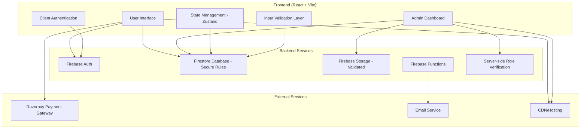

---

## 👤 **User Flow Architecture**

### **Complete User Journey Diagram**

```mermaid
flowchart TD
    Start([User Visits Website]) --> Home[Home Page]
    
    Home --> Browse{Browse Products?}
    Browse -->|Yes| Shop[Shop Page]
    Browse -->|No| About[About/Info Pages]
    
    Shop --> Search[Search/Filter Products]
    Search --> ProductList[Product Listing]
    ProductList --> ProductDetail[Product Detail Page]
    
    ProductDetail --> AddCart{Add to Cart?}
    AddCart -->|Yes| CartUpdate[Update Cart State]
    AddCart -->|No| Wishlist[Add to Wishlist]
    
    CartUpdate --> ContinueShopping{Continue Shopping?}
    ContinueShopping -->|Yes| Shop
    ContinueShopping -->|No| ViewCart[View Cart]
    
    ViewCart --> Checkout{Proceed to Checkout?}
    Checkout -->|No| Shop
    Checkout -->|Yes| AuthCheck{User Authenticated?}
    
    AuthCheck -->|No| Login[Login/Signup Page]
    AuthCheck -->|Yes| CheckoutPage[Checkout Form]
    
    Login --> LoginSuccess{Login Successful?}
    LoginSuccess -->|No| Login
    LoginSuccess -->|Yes| CheckoutPage
    
    CheckoutPage --> PaymentMethod{Select Payment Method}
    PaymentMethod -->|Razorpay| RazorpayFlow[Razorpay Payment Flow]
    PaymentMethod -->|COD| CODFlow[Cash on Delivery]
    
    RazorpayFlow --> PaymentGateway[Razorpay Gateway]
    PaymentGateway --> PaymentResult{Payment Successful?}
    
    PaymentResult -->|Yes| OrderCreated[Order Created in Database]
    PaymentResult -->|No| PaymentFailed[Payment Failed Page]
    
    CODFlow --> OrderCreated
    PaymentFailed --> CheckoutPage
    
    OrderCreated --> EmailConfirmation[Send Order Confirmation Email]
    EmailConfirmation --> OrderSuccess[Order Success Page]
    OrderSuccess --> MyOrders[My Orders Page]
    
    MyOrders --> OrderTracking[Order Tracking]
    OrderTracking --> End([User Journey Complete])
    
    Wishlist --> WishlistPage[Wishlist Management]
    WishlistPage --> Shop
```

### **Authentication & Authorization Flow**
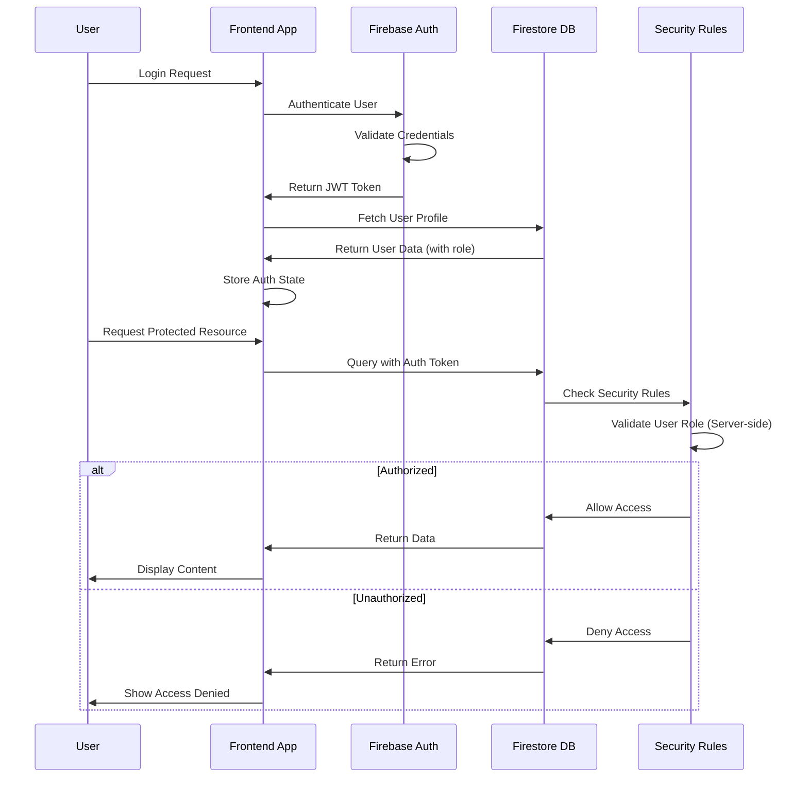

### **Shopping Cart Flow**

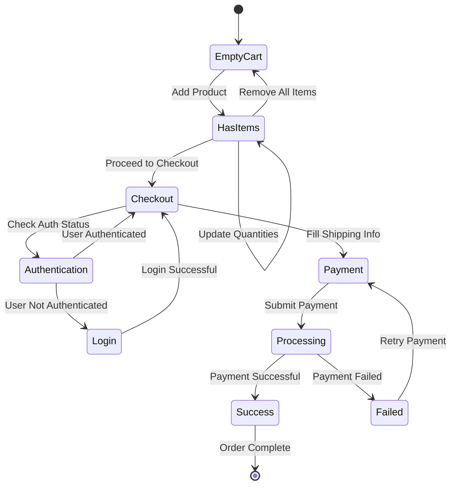

---

## 👨‍💼 **Admin Flow Architecture**

### **Admin Dashboard Workflow**

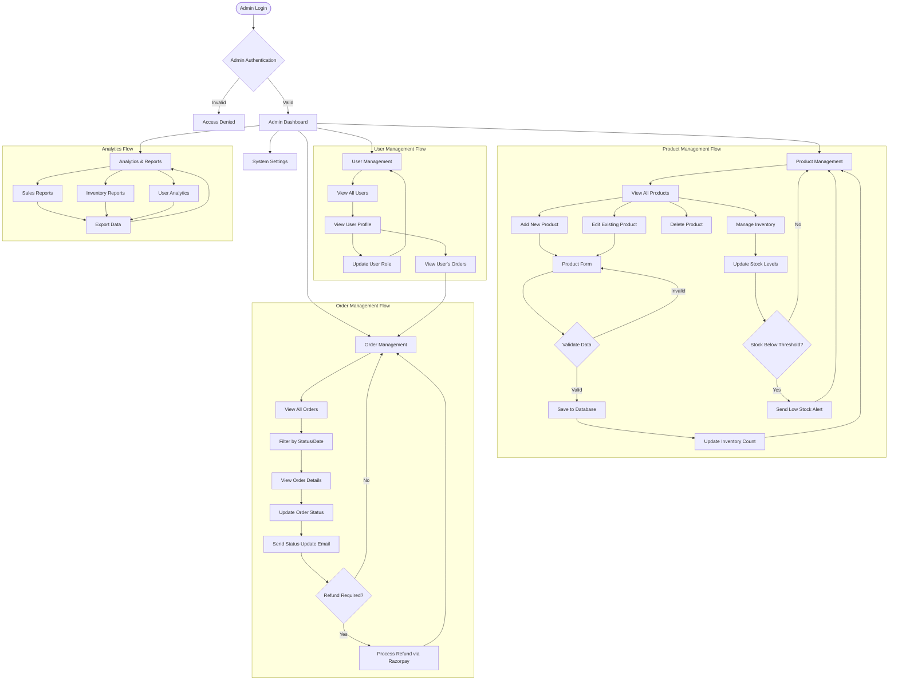

### **Admin Product Management Sequence**

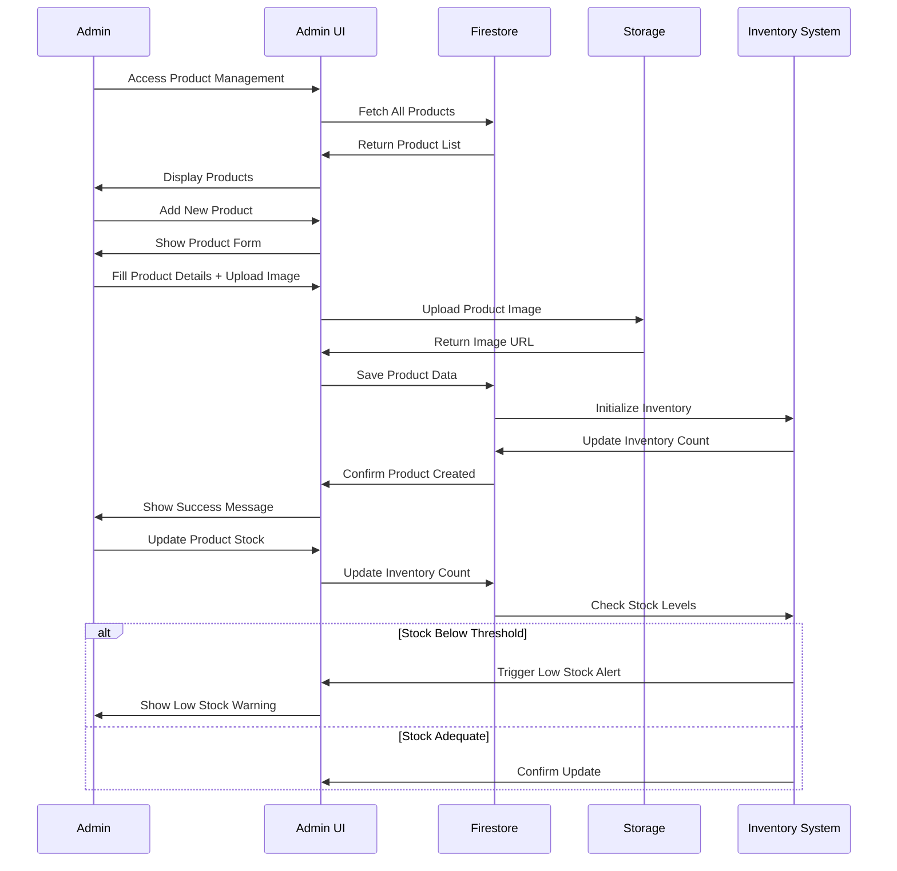

### **Order Processing Workflow**

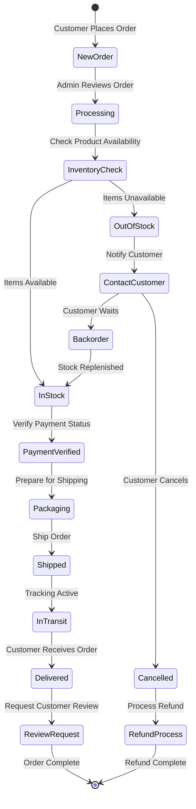

---

## 🔄 **Data Flow Architecture**

### **Real-time Data Synchronization**

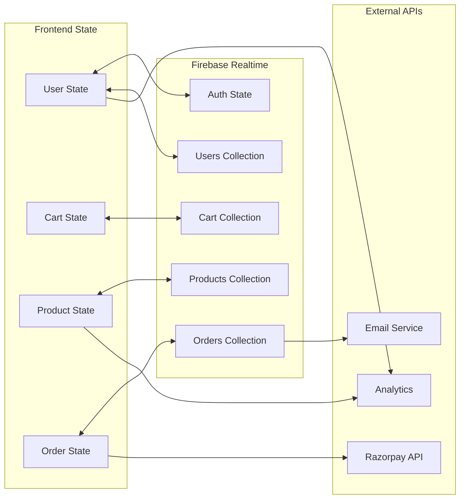

### **Security & Permission Flow**

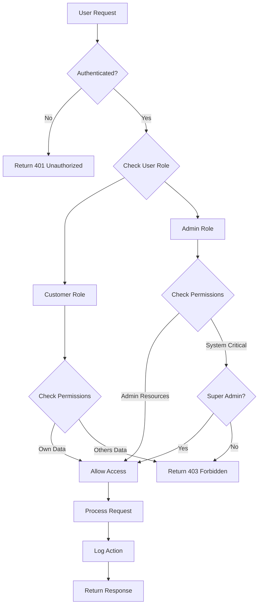

---

## 🏗️ **Component Architecture**

### **Frontend Component Hierarchy**

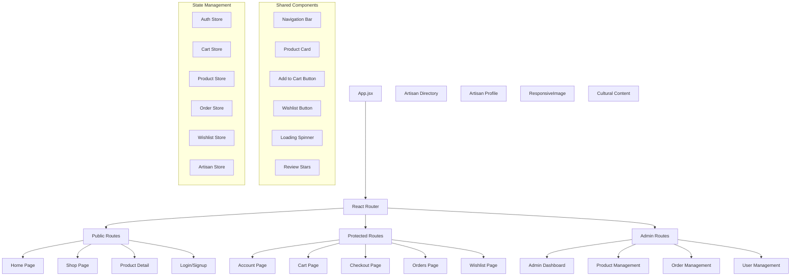

### **Database Schema Relationships**

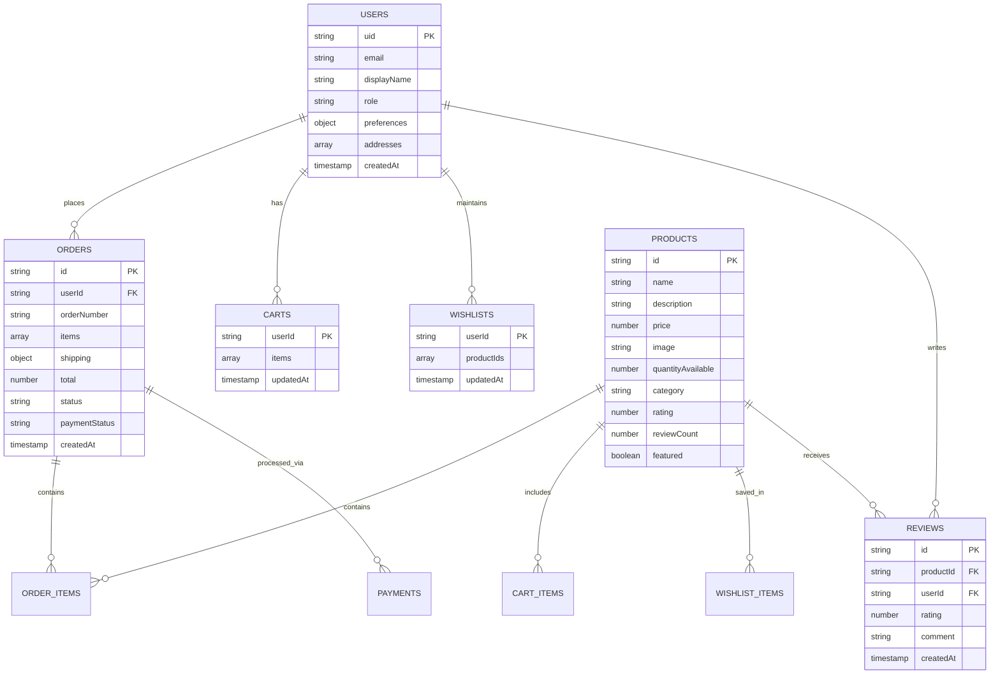

---

## 🔧 **Technical Implementation Details**

### **API Integration Flow**

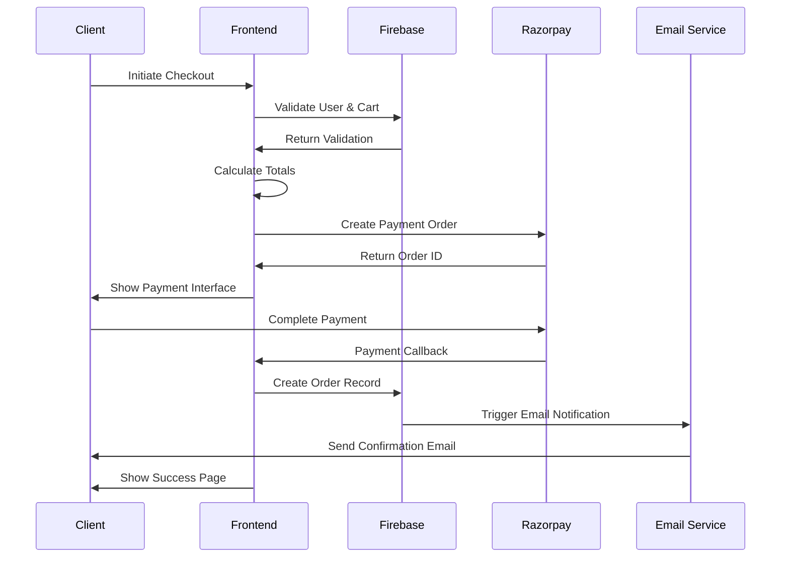

### **Error Handling & Recovery**

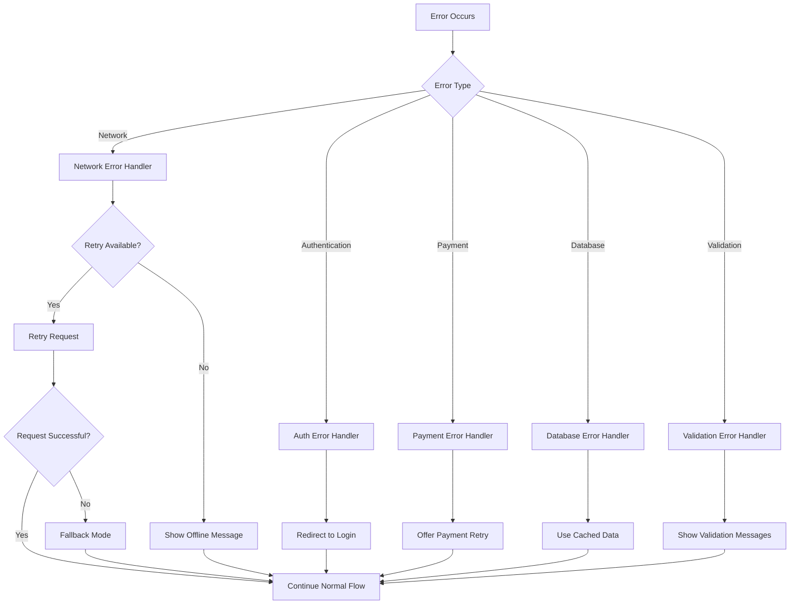

---

## 📱 **Mobile-First Architecture**

### **Responsive Design Flow**

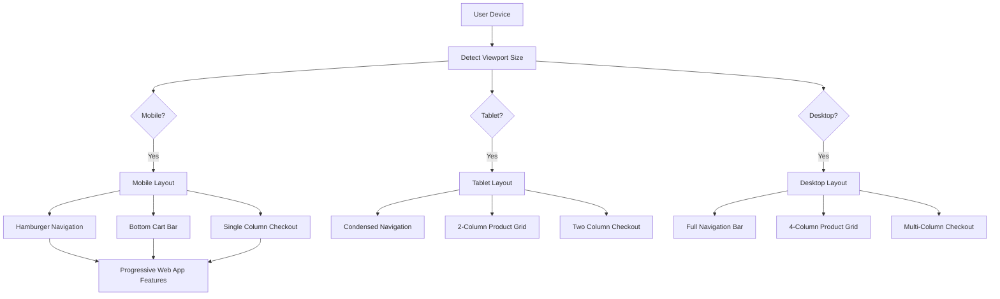

This comprehensive architecture documentation provides a complete visual understanding of your Ramro e-commerce application's user flows, admin workflows, and technical implementation. The diagrams show how all components interact and provide a roadmap for development and maintenance.