# 🏗️ System Architecture - Ramro E-commerce Platform

## 🎯 **High-Level Architecture Overview**

This document provides a comprehensive view of the Ramro e-commerce system architecture, including all components, data flows, and integrations.

---

## 🌐 **Overall System Architecture**

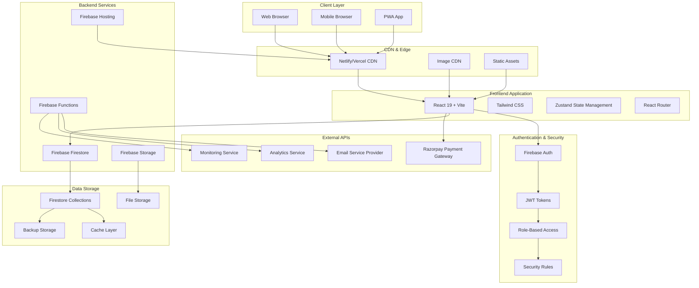

---

## 🔧 **Frontend Architecture**

### **Component Architecture**
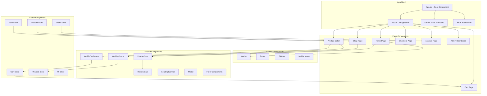

### **State Management Flow**
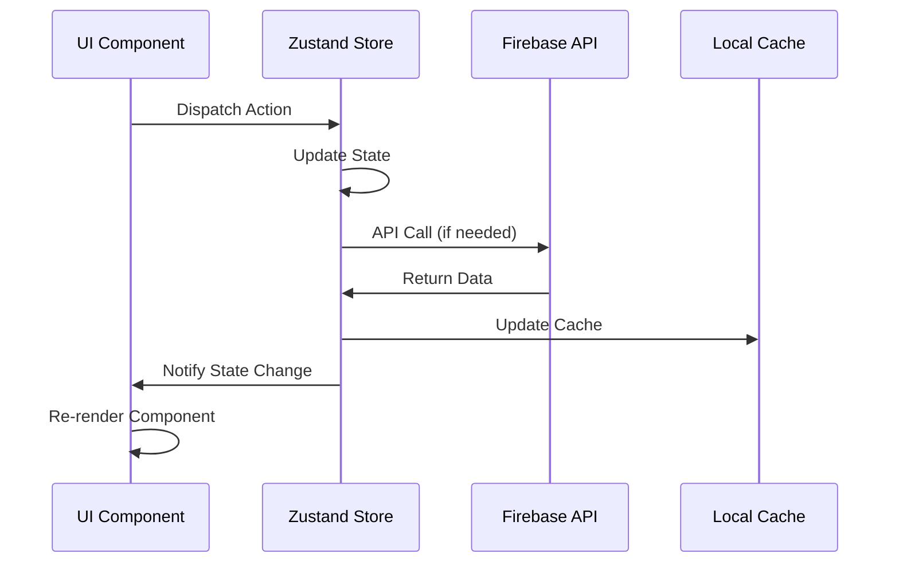

---

## 🗄️ **Database Architecture**

### **Firestore Collections Structure**
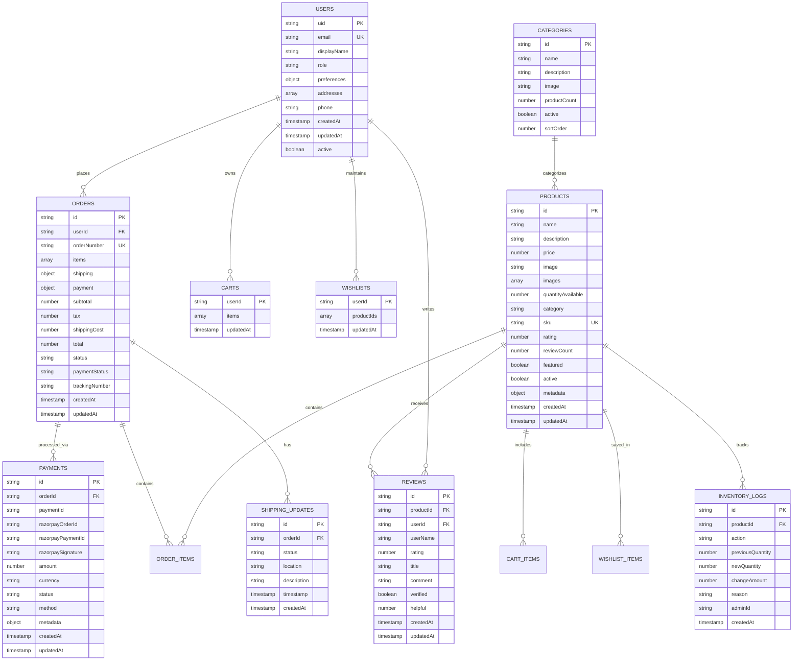

### **Data Access Patterns**
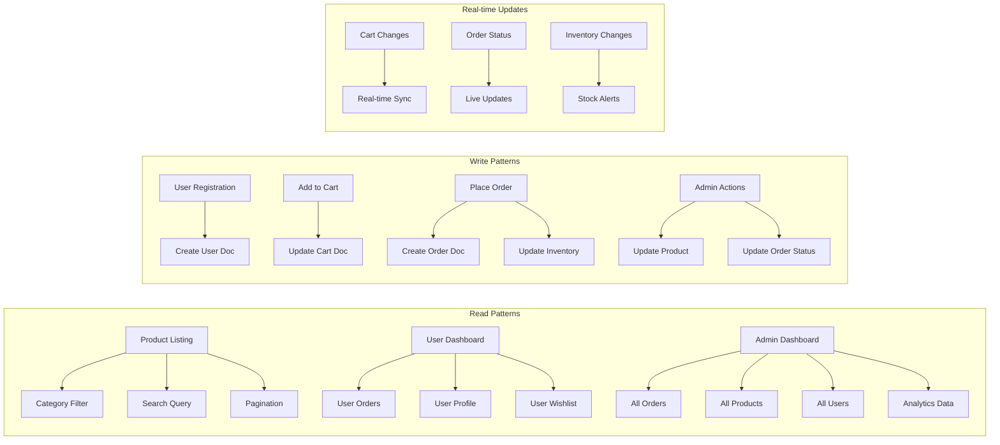

---

## 🔐 **Security Architecture**

### **Authentication & Authorization Flow**
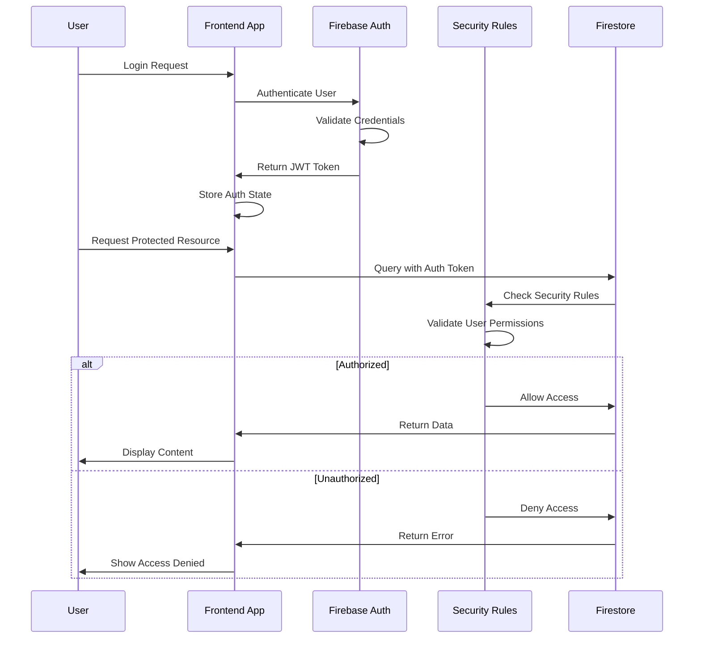

### **Security Rules Structure**
```javascript
// Firestore Security Rules Architecture
rules_version = '2';
service cloud.firestore {
  match /databases/{database}/documents {
    // User data access
    match /users/{userId} {
      allow read, write: if request.auth != null && 
        request.auth.uid == userId;
    }
    
    // Product access (public read, admin write)
    match /products/{productId} {
      allow read: if true;
      allow write: if isAdmin();
    }
    
    // Order access (user owns order)
    match /orders/{orderId} {
      allow read, write: if request.auth != null && 
        request.auth.uid == resource.data.userId;
      allow create: if request.auth != null && 
        request.auth.uid == request.resource.data.userId;
    }
    
    // Admin-only collections
    match /admin/{document=**} {
      allow read, write: if isAdmin();
    }
    
    // Helper function
    function isAdmin() {
      return request.auth != null && 
        exists(/databases/$(database)/documents/users/$(request.auth.uid)) &&
        get(/databases/$(database)/documents/users/$(request.auth.uid)).data.role == 'admin';
    }
  }
}
```

---

## 💳 **Payment Processing Architecture**

### **Razorpay Integration Flow**
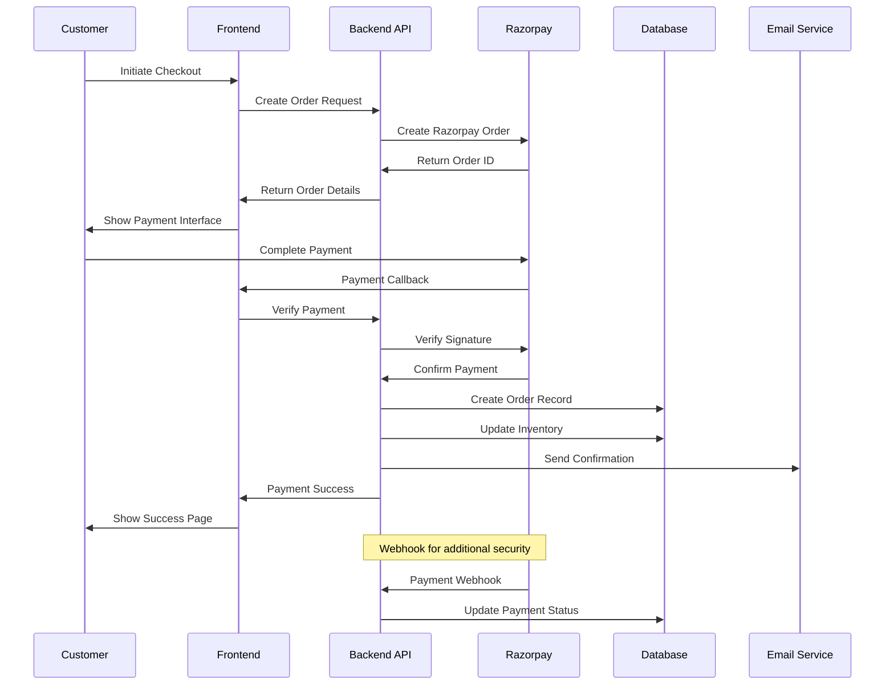

### **Payment Method Support**
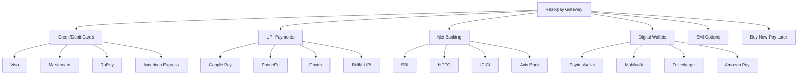

---

## 📧 **Communication Architecture**

### **Email Service Integration**
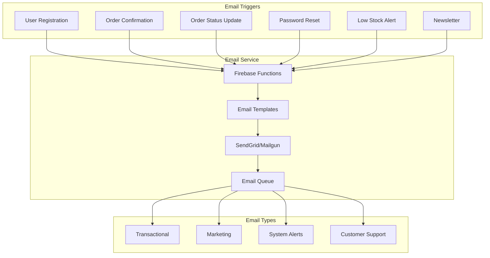

### **Notification System**
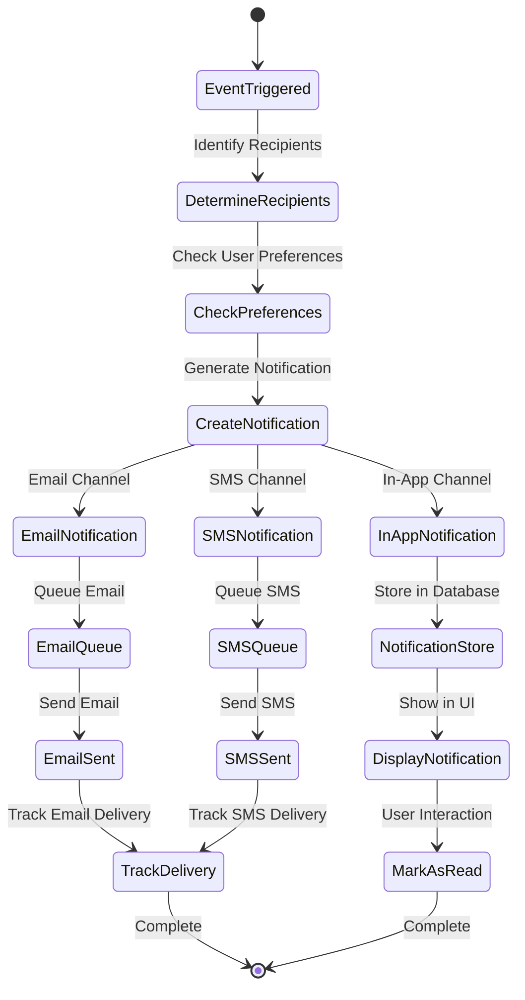

---

## 📊 **Analytics & Monitoring Architecture**

### **Data Collection & Analysis**
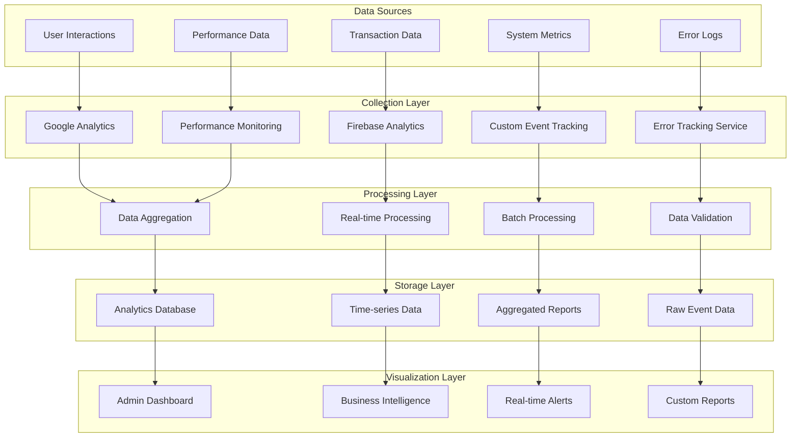

---

## 🚀 **Deployment Architecture**

### **CI/CD Pipeline**
```mermaid
graph LR
    subgraph "Development"
        A[Local Development]
        B[Git Repository]
        C[Feature Branches]
    end
    
    subgraph "CI/CD Pipeline"
        D[GitHub Actions]
        E[Build Process]
        F[Testing Suite]
        G[Security Scan]
        H[Code Quality Check]
    end
    
    subgraph "Staging Environment"
        I[Staging Deployment]
        J[Integration Testing]
        K[Performance Testing]
        L[User Acceptance Testing]
    end
    
    subgraph "Production Environment"
        M[Production Deployment]
        N[Health Checks]
        O[Monitoring]
        P[Rollback Capability]
    end
    
    A --> B
    B --> C
    C --> D
    D --> E
    E --> F
    F --> G
    G --> H
    H --> I
    I --> J
    J --> K
    K --> L
    L --> M
    M --> N
    N --> O
    O --> P
```

### **Infrastructure Components**
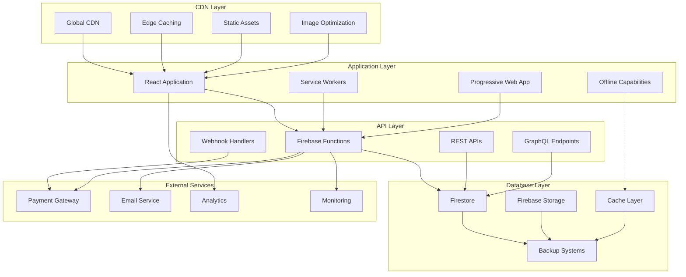

---

## 🔄 **Scalability Considerations**

### **Horizontal Scaling Strategy**
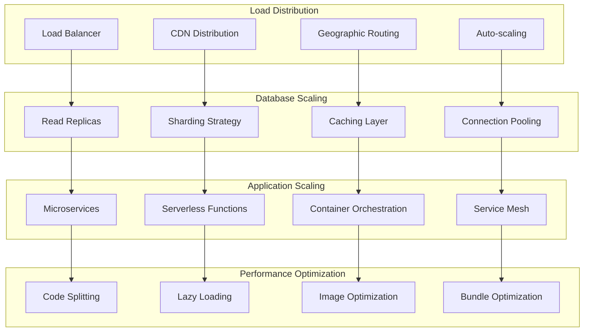

This comprehensive system architecture documentation provides a complete technical overview of the Ramro e-commerce platform, covering all aspects from frontend components to backend services, security, and scalability considerations.