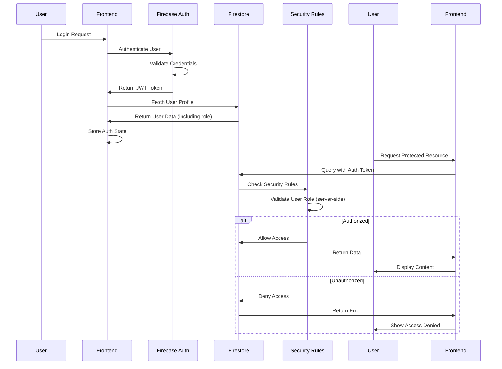
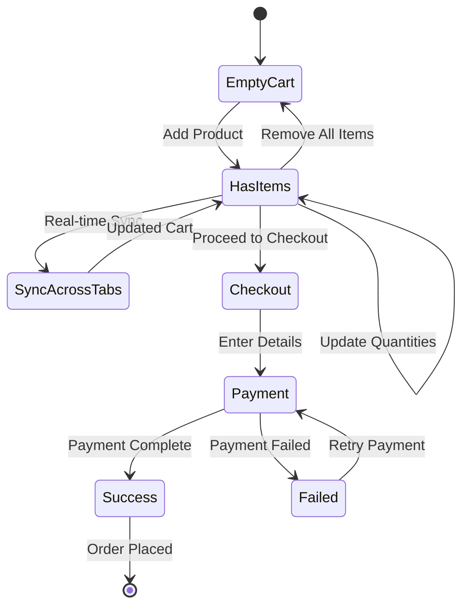
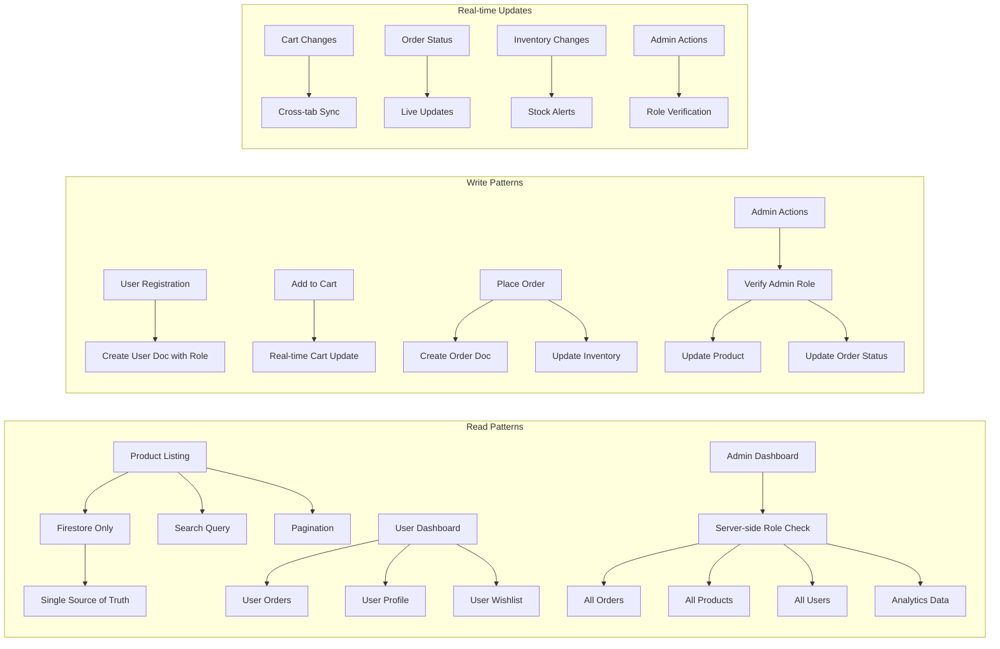

# 👤 User Flow Diagram - Ramro E-commerce

## 🔒 **SECURITY-ENHANCED USER FLOWS**
**IMPORTANT**: All user flows now include enterprise-grade security:
- ✅ Server-side admin role verification (no hardcoded access)
- ✅ Secure file upload validation
- ✅ Real-time cart synchronization across sessions
- ✅ Single source of truth data integrity
- ✅ Comprehensive input validation and XSS prevention

## 🎯 **Complete User Journey Map**

This document provides a detailed visual representation of the user experience flow through the Ramro e-commerce platform.

**NEW: Artisan Discovery Journey**
```
🏠 Landing → 👨‍🎨 Artisans → 📖 Stories → 🛍️ Products → 💝 Cultural Connection
```

---

## 📱 **User Flow Overview**

```
🏠 Landing → 🛍️ Browse → 🛒 Cart → 💳 Checkout → ✅ Order Complete
           ↓
       👨‍🎨 Artisans → 📖 Cultural Stories → 🤝 Emotional Connection
```

---

## 🔄 **Detailed User Flow Steps**

### **1. Discovery & Landing (Entry Points)**
```
📱 Social Media → 🏠 Homepage
🔍 Google Search → 🏠 Homepage  
📧 Email Link → 🏠 Homepage
🔗 Direct URL → 🏠 Homepage
```

### **2. Product Discovery Flow**
```
🏠 Homepage → 🛍️ Shop Page
           → 🔍 Search Products
           → 📂 Category Filter
           → 📄 Product Detail
           → 👨‍🎨 Artisan Profile
           → 📖 Cultural Story
```

### **3. Artisan Discovery Flow**
```
🏠 Homepage → 👨‍🎨 Artisans Directory
           → 🔍 Search Artisans
           → 🗺️ Regional Filter
           → 📄 Artisan Profile
           → 📖 Cultural Heritage
           → 🛍️ Artisan Products
           → 💝 Impact Story
```

### **3. Shopping & Cart Management**
```
📄 Product Detail → ➕ Add to Cart
                 → ❤️ Add to Wishlist
                 → 🛒 View Cart
                 → ➕➖ Update Quantities
                 → 🗑️ Remove Items
```

### **4. Authentication Flow**
```
🛒 Checkout → 🔐 Login Required?
           → 📝 Sign Up (New User)
           → 🔑 Login (Existing User)
           → 🌐 Google OAuth
           → ✅ Authenticated
```

### **Authentication Flow Detail**



### **5. Checkout Process**
```
✅ Authenticated → 📋 Shipping Info
                → 💳 Payment Method
                → 🏦 Razorpay Gateway
                → ✅ Payment Success
                → 📧 Order Confirmation
```

### **Shopping Cart Flow**



### **6. Post-Purchase Experience**
```
📧 Order Confirmation → 📱 Order Tracking
                     → 📦 Shipping Updates
                     → ✅ Delivery Confirmation
                     → ⭐ Review Request
                     → 🔄 Repeat Purchase
```

---

## 🎨 **Visual User Interface Flow**

### **Homepage Experience**
```
┌─────────────────────────────────────┐
│ 🏔️ RAMRO - Himalayan Products      │
│ ═══════════════════════════════════ │
│                                     │
│ 🖼️ Hero Image with CTA             │
│ "Experience Pure Local Goodness"    │
│                                     │
│ [Shop Now] [Learn More]            │
│                                     │
│ 🌟 Featured Products Grid          │
│ ┌─────┐ ┌─────┐ ┌─────┐ ┌─────┐   │
│ │ 🥒  │ │ 🍯  │ │ 🌾  │ │ 🧂  │   │
│ │Pickle│Honey │Rice │Salt │   │
│ └─────┘ └─────┘ └─────┘ └─────┘   │
│                                     │
│ 💬 Customer Testimonials           │
│ 📞 Contact Information             │
└─────────────────────────────────────┘
```

### **Product Browsing Experience**
```
┌─────────────────────────────────────┐
│ 🔍 Search: [himalayan honey    ] 🔎│
│ 📂 Category: [All ▼] Sort: [Name ▼]│
│ ═══════════════════════════════════ │
│                                     │
│ Product Grid (Responsive)           │
│ ┌─────────┐ ┌─────────┐ ┌─────────┐│
│ │ 🖼️ Image │ │ 🖼️ Image │ │ 🖼️ Image ││
│ │ Product  │ │ Product  │ │ Product  ││
│ │ ⭐⭐⭐⭐⭐ │ │ ⭐⭐⭐⭐☆ │ │ ⭐⭐⭐⭐⭐ ││
│ │ ₹299     │ │ ₹499     │ │ ₹199     ││
│ │[Add Cart]│ │[Add Cart]│ │[Add Cart]││
│ │ ❤️ Wish  │ │ ❤️ Wish  │ │ ❤️ Wish  ││
│ └─────────┘ └─────────┘ └─────────┘│
└─────────────────────────────────────┘
```

### **Shopping Cart Experience**
```
┌─────────────────────────────────────┐
│ 🛒 Shopping Cart (3 items)         │
│ ═══════════════════════════════════ │
│                                     │
│ ┌─────────────────────────────────┐ │
│ │ 🖼️ Darjeeling Pickle           │ │
│ │ ₹299 × [2] = ₹598              │ │
│ │ [➖] [➕] [🗑️]                   │ │
│ └─────────────────────────────────┘ │
│                                     │
│ ┌─────────────────────────────────┐ │
│ │ 🖼️ Wild Honey                  │ │
│ │ ₹499 × [1] = ₹499              │ │
│ │ [➖] [➕] [🗑️]                   │ │
│ └─────────────────────────────────┘ │
│                                     │
│ ─────────────────────────────────── │
│ Subtotal: ₹1,097                   │
│ Tax: ₹88                           │
│ Shipping: Free                     │
│ ─────────────────────────────────── │
│ Total: ₹1,185                      │
│                                     │
│ [Continue Shopping] [Checkout] 💳   │
└─────────────────────────────────────┘
```

### **Checkout Flow Experience**
```
Step 1: Shipping Information
┌─────────────────────────────────────┐
│ 📋 Shipping Details                │
│ ═══════════════════════════════════ │
│ Name: [John Doe            ]        │
│ Email: [john@email.com     ]        │
│ Phone: [+91 9876543210     ]        │
│ Address: [123 Main Street  ]        │
│ City: [Mumbai              ]        │
│ ZIP: [400001               ]        │
│                                     │
│ [Back to Cart] [Continue] →         │
└─────────────────────────────────────┘

Step 2: Payment Method
┌─────────────────────────────────────┐
│ 💳 Payment Method                  │
│ ═══════════════════════════════════ │
│ ○ Credit/Debit Card                │
│ ○ UPI (Google Pay, PhonePe)        │
│ ○ Net Banking                      │
│ ○ Digital Wallets                  │
│ ● Cash on Delivery                 │
│                                     │
│ Order Total: ₹1,185                │
│ [← Back] [Place Order] ✅          │
└─────────────────────────────────────┘

Step 3: Payment Gateway (Razorpay)
┌─────────────────────────────────────┐
│ 🏦 Razorpay Secure Payment         │
│ ═══════════════════════════════════ │
│ Order: #ORD-2024-001               │
│ Amount: ₹1,185                     │
│                                     │
│ 💳 [Card] 📱[UPI] 🏦[NetBanking]   │
│                                     │
│ Card Number: [1234 5678 9012 3456] │
│ Expiry: [12/25] CVV: [123]         │
│ Name: [John Doe                ]    │
│                                     │
│ [Cancel] [Pay ₹1,185] 🔒           │
└─────────────────────────────────────┘
```

---

## 📊 **User Interaction Patterns**

### **Navigation Patterns**
```
Desktop Navigation:
🏔️ Ramro | Home | Shop | Cart(3) | Account | Login

Mobile Navigation:
☰ Menu | 🏔️ Ramro | 🛒(3)

Mobile Menu Expanded:
┌─────────────┐
│ ✕ Close     │
│ 🏠 Home     │
│ 🛍️ Shop     │
│ 🛒 Cart (3) │
│ 👤 Account  │
│ 🔑 Login    │
└─────────────┘
```

### **Product Interaction States**
```
Product Card States:
┌─────────────┐
│ 🖼️ Image    │ ← Hover: Zoom effect
│ Product Name │
│ ⭐⭐⭐⭐⭐    │ ← Click: Show reviews
│ ₹299        │
│ [Add Cart]  │ ← Click: Add to cart
│ ❤️ Wishlist │ ← Click: Toggle wishlist
└─────────────┘

Out of Stock:
┌─────────────┐
│ 🖼️ Image    │ ← Grayed out
│ Product Name │
│ ⭐⭐⭐⭐⭐    │
│ ₹299        │
│ [Out Stock] │ ← Disabled button
│ ❤️ Wishlist │ ← Still functional
└─────────────┘
```

---

## 🔄 **State Management Flow**

### **Cart State Updates**
```
User Action → Frontend State → Firebase Sync → UI Update

Add to Cart:
Click [Add] → cartStore.addToCart() → Save to Firestore → Update cart count

Update Quantity:
Click [+/-] → cartStore.updateQuantity() → Save to Firestore → Update totals

Remove Item:
Click [🗑️] → cartStore.removeFromCart() → Save to Firestore → Update UI
```

### **Authentication State Flow**
```
Login Attempt → Firebase Auth → User Profile Fetch → State Update → Route Protection

Login Success:
Submit Form → Firebase.signIn() → Fetch user profile → authStore.setUser() → Redirect to dashboard

Logout:
Click Logout → Firebase.signOut() → Clear user state → authStore.clearUser() → Redirect to home
```

### **Data Access Patterns**


---

## 📱 **Mobile-First User Experience**

### **Mobile Shopping Flow**
```
📱 Mobile Device
    ↓
🏠 Mobile Homepage (Touch-optimized)
    ↓
🛍️ Mobile Shop (Infinite scroll)
    ↓
📄 Mobile Product Detail (Swipe gallery)
    ↓
🛒 Mobile Cart (Bottom sheet)
    ↓
💳 Mobile Checkout (Single column)
    ↓
📱 Mobile Payment (Native UPI apps)
    ↓
✅ Mobile Success (Share options)
```

### **Touch Interactions**
```
Gestures Supported:
- 👆 Tap: Select/Navigate
- 👆👆 Double Tap: Quick add to cart
- 👈👉 Swipe: Product image gallery
- 📏 Pinch: Zoom product images
- ⬆️ Pull to Refresh: Update product list
- ⬇️ Infinite Scroll: Load more products
```

---

## 🎯 **Conversion Optimization Points**

### **Critical User Decision Points**
```
1. Homepage → Shop: "Shop Now" CTA
2. Product List → Product Detail: Product appeal
3. Product Detail → Add to Cart: Product information quality
4. Cart → Checkout: Trust signals and security
5. Checkout → Payment: Payment method availability
6. Payment → Success: Payment process smoothness
```

### **Abandonment Prevention**
```
Cart Abandonment:
- Save cart across sessions
- Show shipping costs early
- Multiple payment options
- Guest checkout option

Checkout Abandonment:
- Progress indicators
- Security badges
- Multiple payment methods
- Clear error messages
```

---

## 📈 **User Analytics Tracking Points**

### **Key User Events to Track**
```
Page Views:
- Homepage visits
- Product page views
- Cart page views
- Checkout page views

User Actions:
- Product searches
- Add to cart events
- Wishlist additions
- Account registrations
- Purchase completions

Engagement Metrics:
- Time on site
- Pages per session
- Bounce rate
- Conversion rate
```

This comprehensive user flow diagram provides a complete picture of how users interact with your Ramro e-commerce platform, from initial discovery through post-purchase experience.