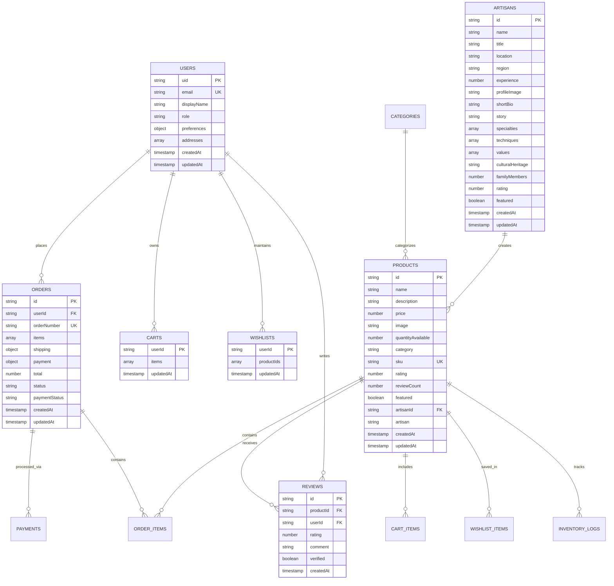
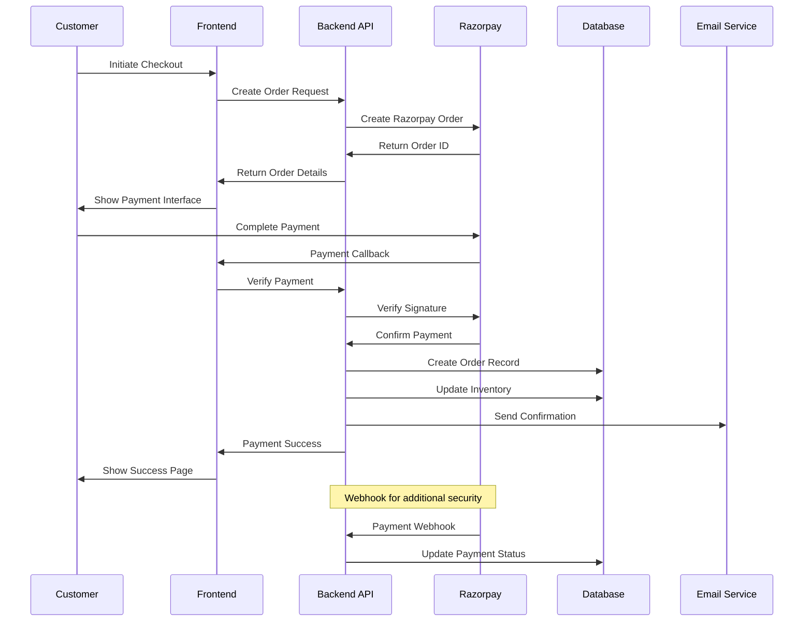
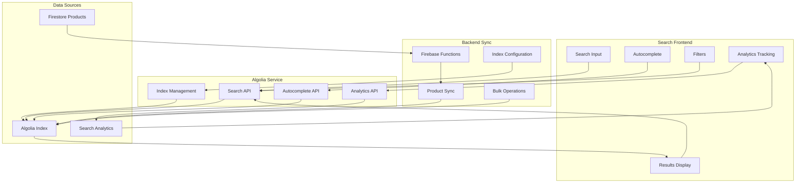
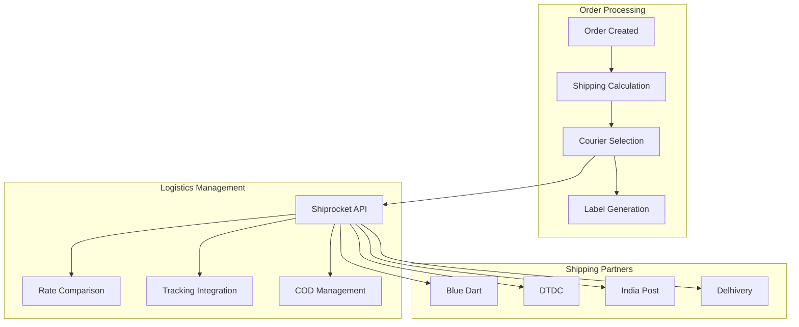
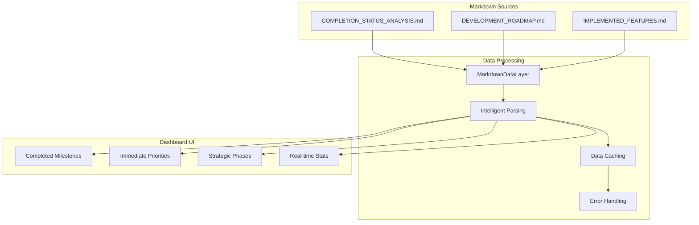

# 🏗️ System Architecture - Ramro E-commerce Platform

## 📋 Table of Contents

1. [Architecture Overview](#architecture-overview)
2. [System Components](#system-components)
3. [Database Architecture](#database-architecture)
4. [Authentication & Security](#authentication--security)
5. [Search Architecture](#search-architecture)
6. [Payment Processing](#payment-processing)
7. [Real-time Features](#real-time-features)
8. [Logistics Integration](#logistics-integration)
9. [Dynamic Dashboard Architecture](#dynamic-dashboard-architecture)
10. [User Flow Diagrams](#user-flow-diagrams)
11. [Admin Flow Diagrams](#admin-flow-diagrams)
12. [Data Flow](#data-flow)
13. [Security Architecture](#security-architecture)
14. [Performance Considerations](#performance-considerations)
15. [Scalability](#scalability)

---

## Architecture Overview

**COMPREHENSIVE SYSTEM DESIGN**: This document provides complete architectural documentation for the Ramro e-commerce platform, covering all systems, flows, and integrations.

**DYNAMIC DASHBOARD INTEGRATION**: The platform now includes a sophisticated markdown-driven dashboard that provides real-time strategic visualization.

This comprehensive architecture documentation provides a complete technical overview of the Ramro e-commerce platform, covering all aspects from frontend components to backend services, security, and scalability considerations.

---

# 🗄️ **DATABASE ARCHITECTURE**

## **Firestore Collections Structure**



## **Security Rules Architecture**

```javascript
// Firestore Security Rules
rules_version = '2';
service cloud.firestore {
  match /databases/{database}/documents {
    // Server-side admin verification
    function isAdmin() {
      return request.auth != null && 
        exists(/databases/$(database)/documents/users/$(request.auth.uid)) &&
        get(/databases/$(database)/documents/users/$(request.auth.uid)).data.role == 'admin';
    }
    
    // User data access
    match /users/{userId} {
      allow read, write: if request.auth != null && request.auth.uid == userId;
    }
    
    // Product access (public read, admin write)
    match /products/{productId} {
      allow read: if true;
      allow write: if isAdmin();
    }
    
    // Artisan access (public read, admin write)
    match /artisans/{artisanId} {
      allow read: if true;
      allow write: if isAdmin();
    }
    
    // Order access (user owns order or admin)
    match /orders/{orderId} {
      allow read: if request.auth != null && 
        (request.auth.uid == resource.data.userId || isAdmin());
      allow write: if request.auth != null && 
        request.auth.uid == resource.data.userId;
    }
    
    // Cart access (user owns cart)
    match /carts/{userId} {
      allow read, write: if request.auth != null && request.auth.uid == userId;
    }
    
    // Wishlist access (user owns wishlist)
    match /wishlists/{userId} {
      allow read, write: if request.auth != null && request.auth.uid == userId;
    }
    
    // Reviews (public read, authenticated write)
    match /reviews/{reviewId} {
      allow read: if true;
      allow create: if request.auth != null && 
        request.auth.uid == request.resource.data.userId;
      allow update, delete: if request.auth != null && 
        request.auth.uid == resource.data.userId;
    }
  }
}
```

---

# 💳 **PAYMENT PROCESSING ARCHITECTURE**

## **Razorpay Integration Flow**



---

# 🔍 **SEARCH ARCHITECTURE**

## **Algolia Search Integration**



## **Search Performance Metrics**
- **Response Time**: <500ms for instant search
- **Autocomplete**: <200ms for suggestions
- **Index Size**: Optimized for fast queries
- **Analytics**: Real-time search behavior tracking

## Data Flow

> **📝 Note**: To edit the data flow diagram, please modify the source file at `docs/diagrams/data-flow.md`

### **Real-time Data Synchronization**

The application implements sophisticated real-time data flow:

---

# 🚚 **LOGISTICS INTEGRATION ARCHITECTURE**

## **Shipping Partner Integration**



## **Logistics Flow Architecture**

### **Phase 0: Basic Logistics (Manual)**
- Manual courier partner selection
- Basic shipping label generation
- Simple order tracking
- COD workflow setup

### **Phase 2: Advanced Automation**
- Multi-courier integration via Shiprocket
- Automated rate comparison
- Intelligent courier selection
- Returns management automation

---

# 📊 **DYNAMIC DASHBOARD ARCHITECTURE**

## **Markdown Data Layer**



## **Dashboard Features**

### **Real-time Data Synchronization**
- Automatic markdown file fetching
- Intelligent content parsing
- 5-minute caching for performance
- Manual refresh capability

### **Visual Progress Tracking**
- Dynamic completion percentages
- Category-based feature organization
- Priority-based task visualization
- Timeline and resource planning

### **Strategic Business Intelligence**
- Phase progression tracking
- Success metrics dashboard
- Risk management visualization
- Resource requirement planning