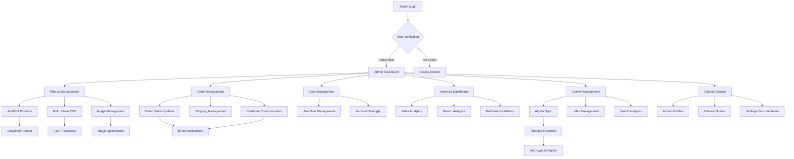

# Admin Flow Diagram

## Admin Workflow Notes

- **Security**: Server-side role verification via Firestore
- **Product Management**: Professional tools with bulk operations
- **Search Management**: Algolia integration with analytics
- **Cultural Content**: Rich artisan storytelling management
- **Real-time Updates**: Automatic synchronization across systems
- **Professional Tools**: Enterprise-grade admin capabilities