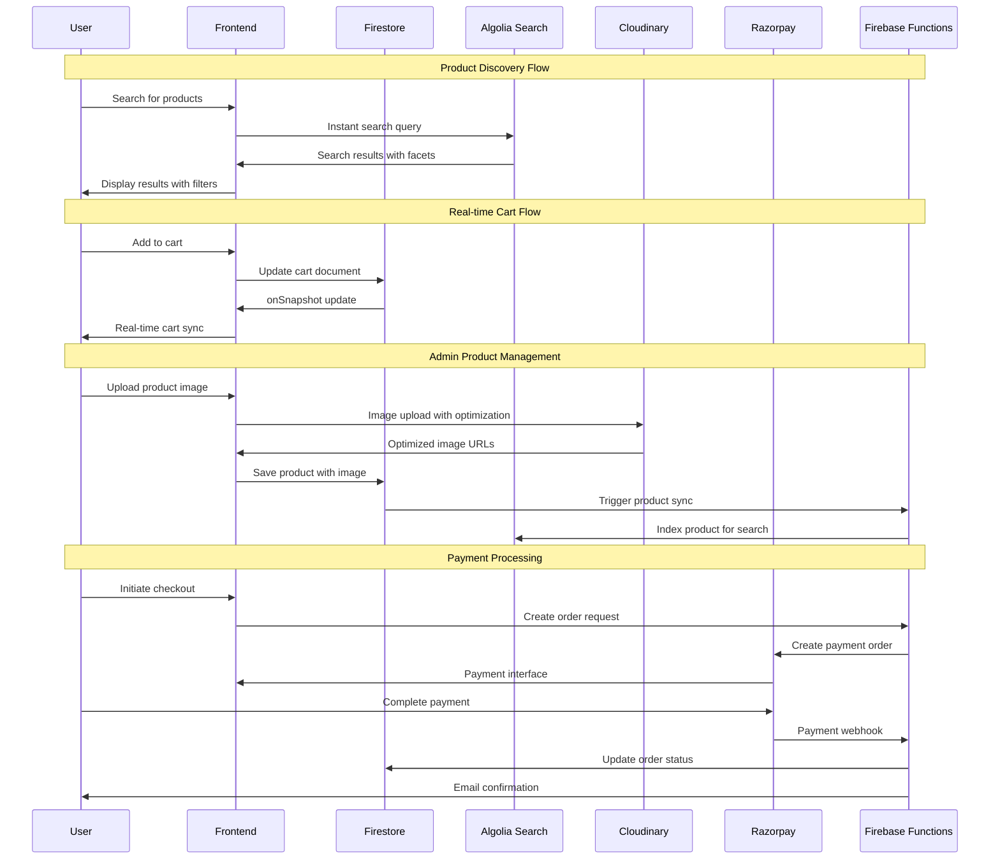

# Data Flow Diagram

## Data Flow Notes

- **Real-time Updates**: Firestore onSnapshot for live synchronization
- **Search Integration**: Automatic product indexing to Algolia
- **Media Optimization**: Cloudinary for responsive image delivery
- **Secure Payments**: Razorpay with webhook verification
- **Email Notifications**: Automated order confirmations