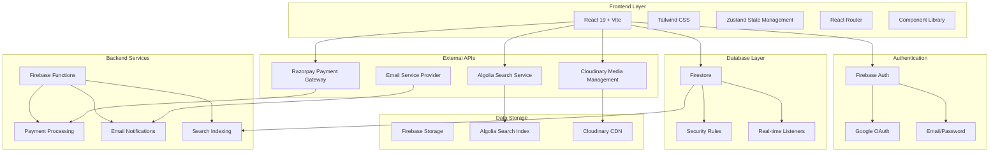

# System Architecture Diagram

## Architecture Notes

- **Frontend**: Modern React 19 with Vite build system
- **State Management**: Zustand with real-time Firebase integration
- **Authentication**: Firebase Auth with multiple providers
- **Database**: Firestore with comprehensive security rules
- **Search**: Algolia for professional search capabilities
- **Media**: Cloudinary for optimized image delivery
- **Payments**: Razorpay for Indian market payment processing
- **Real-time**: Firebase onSnapshot for live updates