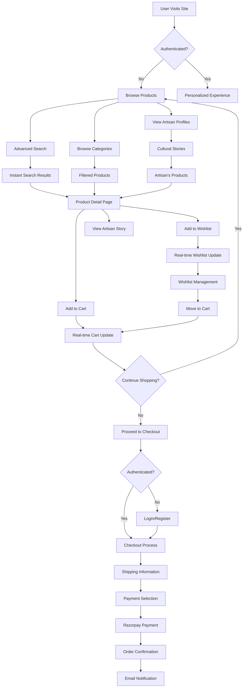

# User Flow Diagram

## User Journey Notes

- **Discovery**: Multiple entry points (search, browse, artisan stories)
- **Real-time**: Cart and wishlist sync across all tabs
- **Cultural Connection**: Artisan stories integrated throughout
- **Seamless Checkout**: Streamlined payment with Razorpay
- **Trust Building**: Order confirmations and email notifications